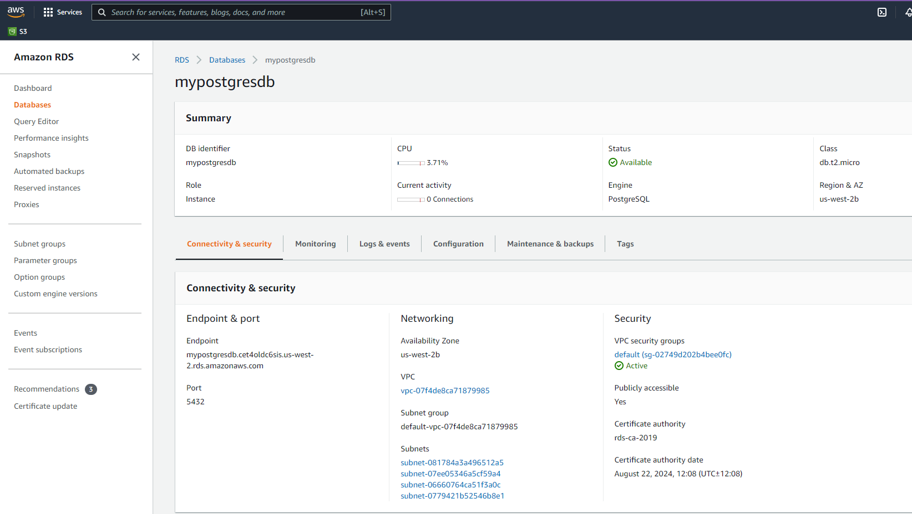
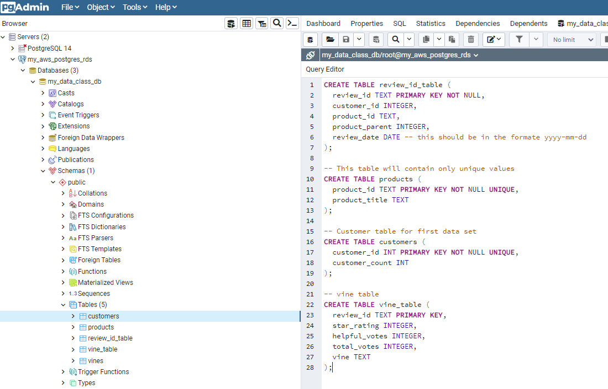

# Big Data Homework - "Alexa, can you handle big data?"

## Background

In this assignment you will put your ETL skills to the test. Many of Amazon's shoppers depend on product reviews to make a purchase. Amazon makes these datasets publicly available. However, they are quite large and can exceed the capacity of local machines to handle. One dataset alone contains over 1.5 million rows; with over 40 datasets, this can be quite taxing on the average local computer. Your first goal for this assignment will be to perform the ETL process completely in the cloud and upload a DataFrame to an RDS instance. The second goal will be to use PySpark or SQL to perform a statistical analysis of selected data.

I worked this entire lesson with my tutor. I only did level one. Project 4 needs more time than I can give to doing level 2 of this homework. Here are screenshots of my sql and aws. I did remove my password from the colab files and they are in the github.

## Submission

* **Important** be sure to clean up all your AWS resources. Consult the [AWS cleanup guide](../Resources/AWS_cleanup.pdf) and [AWS check billing guide](../Resources/AWS_check_billing.pdf) as reference.

* Download you Google Colab notebooks as `.ipynb` files and upload those to GitHub.

* Copy your SQL queries into `.sql` files and upload to GitHub.

* **Important:** Do not upload notebooks that contain your RDS password and endpoint. Be sure to delete them before making your notebook public!

* Ensure your repository has regular commits and a thorough README.md file

## Rubric

[Unit 22 Rubric - Big Data Homework - "Alexa, can you handle big data?"](https://docs.google.com/document/d/1H-TBgBUz1jVGG1zvo046GraApmbepVZgYionh-4mNas/edit?usp=sharing)

- - -

## References

Amazon customer Reviews Dataset. (n.d.). Retrieved April 08, 2021, from: [https://s3.amazonaws.com/amazon-reviews-pds/readme.html](https://s3.amazonaws.com/amazon-reviews-pds/readme.html)

- - -

© 2021 Trilogy Education Services, LLC, a 2U, Inc. brand. Confidential and Proprietary. All Rights Reserved.
